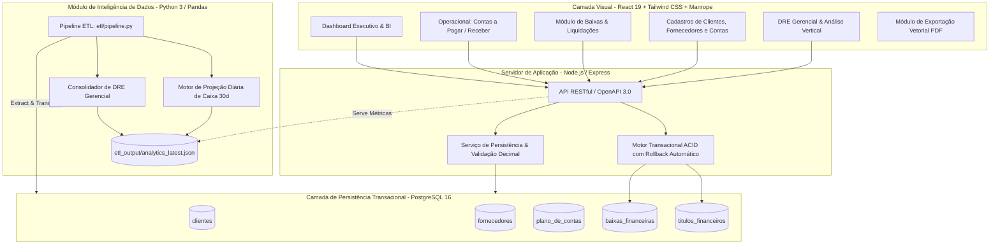
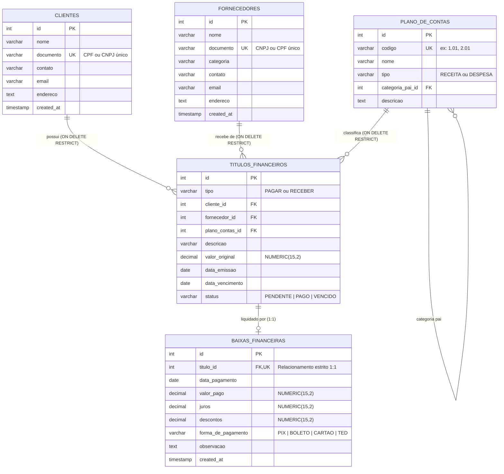

# 💼 Mini-ERP Financeiro & Business Intelligence

> **Sistema Integrado de Gestão Financeira Corporativa para Pequenas e Médias Empresas.**  
> Focado em controle operacional estrito de contas a pagar e receber, liquidações com integridade transacional (**ACID**), inteligência de negócios (**BI**) com **Projeção de Fluxo de Caixa (30 dias)** e **DRE Gerencial** através de um pipeline automatizado de dados.

---

## 📑 Sumário Executivo

1. [Arquitetura Geral do Sistema](#-arquitetura-geral-do-sistema)
2. [Modelagem Relacional & DDL PostgreSQL](#-modelagem-relacional--ddl-postgresql)
3. [Garantia de Isolamento Transacional ACID](#-garantia-de-isolamento-transacional-acid)
4. [Módulo de Inteligência Analítica & Pipeline ETL](#-módulo-de-inteligência-analítica--pipeline-etl)
5. [Infraestrutura, DevOps & Conteinerização](#-infraestrutura-devops--conteinerização)
6. [Catálogo da API RESTful (OpenAPI 3.0)](#-catálogo-da-api-restful-openapi-30)
7. [Guia de Instalação e Execução](#-guia-de-instalação-e-execução)

---

## 🏛️ Arquitetura Geral do Sistema

A solução foi projetada sob uma arquitetura limpa e desacoplada, separando a camada de apresentação, a API corporativa de regras de negócio, o pipeline de dados analítico e o banco de dados relacional com isolamento transacional.



---

## 📊 Modelagem Relacional & DDL PostgreSQL

### Modelo Entidade-Relacionamento (MER)



### Script DDL Oficial (`database/schema.sql`)

```sql
-- Habilita extensão para UUID ou funções auxiliares se necessário
CREATE EXTENSION IF NOT EXISTS "uuid-ossp";

-- 1. Clientes
CREATE TABLE IF NOT EXISTS clientes (
    id SERIAL PRIMARY KEY,
    nome VARCHAR(150) NOT NULL,
    documento VARCHAR(20) NOT NULL UNIQUE,
    contato VARCHAR(100),
    email VARCHAR(100),
    endereco TEXT,
    created_at TIMESTAMP WITH TIME ZONE DEFAULT CURRENT_TIMESTAMP
);

-- 2. Fornecedores
CREATE TABLE IF NOT EXISTS fornecedores (
    id SERIAL PRIMARY KEY,
    nome VARCHAR(150) NOT NULL,
    documento VARCHAR(20) NOT NULL UNIQUE,
    categoria VARCHAR(50),
    contato VARCHAR(100),
    email VARCHAR(100),
    endereco TEXT,
    created_at TIMESTAMP WITH TIME ZONE DEFAULT CURRENT_TIMESTAMP
);

-- 3. Plano de Contas Hierárquico
CREATE TABLE IF NOT EXISTS plano_de_contas (
    id SERIAL PRIMARY KEY,
    codigo VARCHAR(20) NOT NULL UNIQUE,
    nome VARCHAR(100) NOT NULL,
    tipo VARCHAR(10) NOT NULL CHECK (tipo IN ('RECEITA', 'DESPESA')),
    categoria_pai_id INTEGER REFERENCES plano_de_contas(id) ON DELETE SET NULL,
    descricao TEXT
);

-- 4. Títulos Financeiros (Contas a Pagar e Contas a Receber)
CREATE TABLE IF NOT EXISTS titulos_financeiros (
    id SERIAL PRIMARY KEY,
    tipo VARCHAR(10) NOT NULL CHECK (tipo IN ('PAGAR', 'RECEBER')),
    cliente_id INTEGER REFERENCES clientes(id) ON DELETE RESTRICT,
    fornecedor_id INTEGER REFERENCES fornecedores(id) ON DELETE RESTRICT,
    plano_contas_id INTEGER NOT NULL REFERENCES plano_de_contas(id) ON DELETE RESTRICT,
    descricao VARCHAR(255) NOT NULL,
    valor_original NUMERIC(15, 2) NOT NULL CHECK (valor_original > 0),
    data_emissao DATE NOT NULL,
    data_vencimento DATE NOT NULL,
    status VARCHAR(15) NOT NULL DEFAULT 'PENDENTE' CHECK (status IN ('PENDENTE', 'PAGO', 'VENCIDO')),
    CONSTRAINT chk_entidade CHECK (
        (tipo = 'RECEBER' AND cliente_id IS NOT NULL) OR
        (tipo = 'PAGAR' AND fornecedor_id IS NOT NULL)
    )
);

-- 5. Baixas Financeiras (Liquidação Auditada)
CREATE TABLE IF NOT EXISTS baixas_financeiras (
    id SERIAL PRIMARY KEY,
    titulo_id INTEGER NOT NULL UNIQUE REFERENCES titulos_financeiros(id) ON DELETE RESTRICT,
    data_pagamento DATE NOT NULL,
    valor_pago NUMERIC(15, 2) NOT NULL CHECK (valor_pago >= 0),
    juros NUMERIC(15, 2) NOT NULL DEFAULT 0.00 CHECK (juros >= 0),
    descontos NUMERIC(15, 2) NOT NULL DEFAULT 0.00 CHECK (descontos >= 0),
    forma_de_pagamento VARCHAR(20) NOT NULL CHECK (forma_de_pagamento IN ('PIX', 'BOLETO', 'CARTAO', 'TED')),
    observacao TEXT,
    created_at TIMESTAMP WITH TIME ZONE DEFAULT CURRENT_TIMESTAMP
);

-- Índices de Performance Operacional
CREATE INDEX idx_titulos_vencimento ON titulos_financeiros(data_vencimento);
CREATE INDEX idx_titulos_status ON titulos_financeiros(status);
CREATE INDEX idx_titulos_tipo ON titulos_financeiros(tipo);
CREATE INDEX idx_baixas_data ON baixas_financeiras(data_pagamento);
```

---

## 🔒 Garantia de Isolamento Transacional ACID

A operação de liquidação (`POST /api/titulos/:id/baixa`) é o evento mais crítico da rotina financeira. Para evitar corrupção de dados, desvios e pagamentos fantasmas, ela segue isolamento estrito:

### Validação Algorítmica da Liquidação:

$$\text{Valor Efetivamente Pago} = \text{Valor Original do Título} + \text{Juros / Multa} - \text{Descontos Concedidos}$$

### Fluxo Atômico no Backend:

1. **BEGIN TRANSACTION**: Bloqueia a linha do título (`SELECT ... FOR UPDATE`).
2. **Checagem de Idempotência**: Valida se o título já não foi liquidado previamente (`status = 'PAGO'`).
3. **Verificação Aritmética**: Garante que o valor informado pelo operador coincide rigorosamente com os centavos calculados.
4. **Persistência da Baixa**: Insere o registro em `baixas_financeiras` com a data efetiva e a forma de liquidação.
5. **Atualização do Título**: Modifica o status para `PAGO`.
6. **Atualização do Caixa**: Lança a movimentação no saldo imediato da empresa.
7. **COMMIT**: Se tudo for executado sem erros, a transação é confirmada. Caso ocorra qualquer exceção em qualquer etapa, é disparado **ROLLBACK** imediato, garantindo que o banco permaneça íntegro.

---

## 📈 Módulo de Inteligência Analítica & Pipeline ETL

O pipeline de dados (`etl/pipeline.py`) implementa as fases clássicas de Engenharia de Dados:

### 1. Extract (Extração)
- Conecta ao PostgreSQL via SQLAlchemy e Pandas (com fallback de alta precisão nativo) para extrair o estado consolidado de títulos e liquidações.

### 2. Transform (Transformação)
- **Matriz de Projeção Diária (30 dias)**:
  - Inicializa com o **Saldo Atual em Caixa**.
  - Itera dia a dia ao longo de 30 dias futuros.
  - Para cada dia $t$, consolida:
    $$\text{Saldo Projetado}_t = \text{Saldo Projetado}_{t-1} + \sum \text{Recebimentos Previstos}_t - \sum \text{Pagamentos Agendados}_t$$
  - Provisiona títulos vencidos não pagos no dia imediato para sinalizar risco de liquidez.
- **DRE Gerencial (Demonstrativo do Resultado do Exercício)**:
  - **Receita Operacional Bruta**: Soma de todos os títulos a receber liquidados no período.
  - **(-) Deduções**: Descontos comerciais concedidos nas liquidações.
  - **(=) Receita Operacional Líquida**: Base de cálculo (100%).
  - **(-) Despesas Operacionais**: Consolidadas por centro de custo (nuvem, condomínio, pessoal, tributos).
  - **(=) Lucro/Prejuízo Líquido**: Resultado contábil apurado.
  - **Análise Vertical (%)**: Participação de cada grupo de despesa em relação à receita líquida.

### 3. Load (Carga & Persistência)
- O resultado é persistido em `etl_output/analytics_latest.json` e consumido em milissegundos pela rota de alta performance `GET /api/analytics/dashboard`.

---

## 🐳 Infraestrutura, DevOps & Conteinerização

### Orquestração com Docker Compose (`docker-compose.yml`)

O ambiente produtivo orquestra a aplicação full-stack e o banco PostgreSQL de maneira isolada:

```yaml
version: '3.8'

services:
  postgres:
    image: postgres:16-alpine
    container_name: minierp_postgres
    restart: always
    environment:
      POSTGRES_USER: ${POSTGRES_USER:-postgres}
      POSTGRES_PASSWORD: ${POSTGRES_PASSWORD:-postgrespassword}
      POSTGRES_DB: ${POSTGRES_DB:-minierp}
    ports:
      - "5432:5432"
    volumes:
      - postgres_data:/var/lib/postgresql/data
      - ./database/schema.sql:/docker-entrypoint-initdb.d/init.sql
    healthcheck:
      test: ["CMD-SHELL", "pg_isready -U postgres"]
      interval: 5s
      timeout: 5s
      retries: 5

  app:
    build:
      context: .
      dockerfile: Dockerfile
    container_name: minierp_app
    restart: always
    ports:
      - "3000:3000"
    environment:
      NODE_ENV: production
      PORT: 3000
      POSTGRES_HOST: postgres
      POSTGRES_PORT: 5432
      POSTGRES_DB: ${POSTGRES_DB:-minierp}
      POSTGRES_USER: ${POSTGRES_USER:-postgres}
      POSTGRES_PASSWORD: ${POSTGRES_PASSWORD:-postgrespassword}
    depends_on:
      postgres:
        condition: service_healthy

volumes:
  postgres_data:
    driver: local
```

### Dockerfile Multi-Stage (`Dockerfile`)

```dockerfile
# Estágio 1: Build da Aplicação
FROM node:20-alpine AS builder
WORKDIR /app
COPY package*.json ./
RUN npm ci
COPY . .
RUN npm run build

# Estágio 2: Runner de Produção
FROM node:20-alpine AS runner
WORKDIR /app
ENV NODE_ENV=production
ENV PORT=3000
COPY package*.json ./
RUN npm ci --only=production
COPY --from=builder /app/dist ./dist
EXPOSE 3000
CMD ["node", "dist/server.cjs"]
```

---

## 📡 Catálogo da API RESTful (OpenAPI 3.0)

A especificação interativa Swagger está disponível em `http://localhost:3000/api/docs/openapi.json`.

| Método | Rota | Descrição |
| :--- | :--- | :--- |
| `GET` | `/api/health` | Verificação de disponibilidade (*healthcheck*) |
| `GET` | `/api/docs/openapi.json` | Especificação completa OpenAPI 3.0 |
| `GET` | `/api/analytics/dashboard` | Métricas de BI, KPIs, Projeção 30d e DRE Gerencial |
| `POST`| `/api/analytics/recalcular` | Executa o pipeline ETL e atualiza os modelos analíticos |
| `GET` | `/api/titulos` | Lista títulos com filtros (`tipo`, `status`, `busca`) |
| `POST`| `/api/titulos` | Cadastra novo título financeiro (Pagar ou Receber) |
| `DELETE`| `/api/titulos/:id` | Exclui título pendente |
| `POST`| `/api/titulos/:id/baixa` | **Liquidação atômica com garantia transacional (ACID)** |
| `GET` | `/api/baixas` | Histórico auditável de baixas realizadas |
| `GET` | `/api/clientes` | Lista todos os clientes cadastrados |
| `POST`| `/api/clientes` | Cadastra novo cliente |
| `PUT` | `/api/clientes/:id` | Atualiza dados cadastrais do cliente |
| `DELETE`| `/api/clientes/:id` | Exclui cliente (validação `ON DELETE RESTRICT`) |
| `GET` | `/api/fornecedores` | Lista todos os fornecedores |
| `POST`| `/api/fornecedores` | Cadastra novo fornecedor |
| `PUT` | `/api/fornecedores/:id` | Atualiza dados cadastrais do fornecedor |
| `DELETE`| `/api/fornecedores/:id` | Exclui fornecedor (validação `ON DELETE RESTRICT`) |
| `GET` | `/api/plano-contas` | Lista o plano de contas contábil e gerencial |
| `POST`| `/api/demo/reset` | Restaura a base de demonstração para seu estado padrão |

---

## 💻 Guia de Instalação e Execução

### Opção 1: Execução com Docker (Recomendado)

```bash
# 1. Clonar o repositório
git clone https://github.com/seu-usuario/mini-erp-financeiro.git
cd mini-erp-financeiro

# 2. Subir o ambiente completo
docker compose up --build -d

# 3. Acessar a aplicação
# Interface Web: http://localhost:3000
```

### Opção 2: Execução Local (Node.js & Python)

```bash
# 1. Instalar as dependências do projeto
npm install

# 2. Iniciar o servidor de desenvolvimento (Express + Vite na porta 3000)
npm run dev

# 3. Executar o Pipeline ETL em segundo plano (Opcional)
python3 etl/pipeline.py
```

---

## 📄 Licença e Padrões de Engenharia

- **Tipografia**: Manrope & JetBrains Mono (alinhamento numérico tabular).
- **Cores & Acessibilidade**: Paleta corporativa *slate* de alto contraste com conformidade WCAG AA.
- **Padrão de Precisão Numérica**: Aritmética decimal imune a imprecisões de ponto flutuante.
